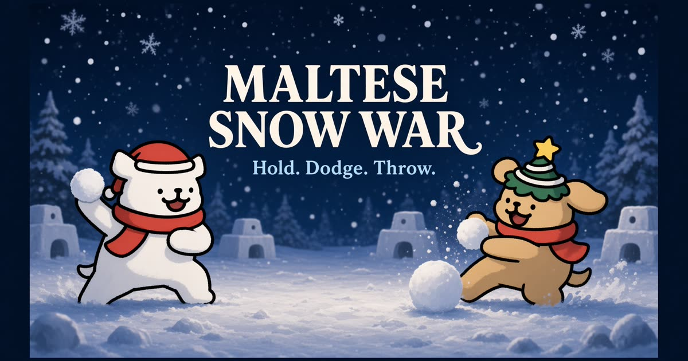
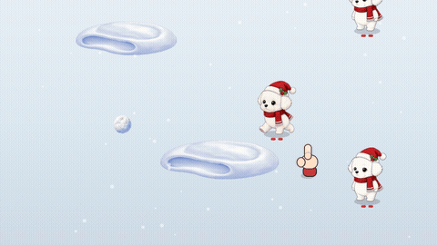
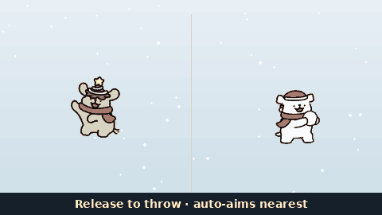
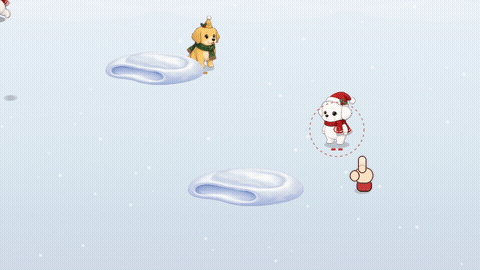
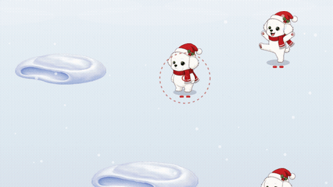
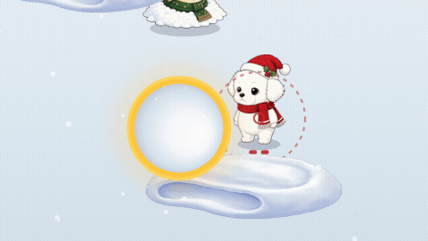
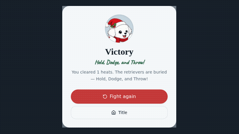

# Maltese Snow War
A browser-based snowball fight: three Maltese vs golden retrievers. Fan tribute to the Flash game “SnowCraft”. Hold a dog to move, release to throw, pack snow between shots. Two hits bury; ellipse forts block shots.

**Play Now:** [maltese-snowwar.grok.me](https://maltese-snowwar.grok.me/)

> Unofficial fan tribute (二次創作) to Nicholson NY’s **SnowCraft** (1998). This repo only contains the original chibi pups as game characters, which is inspired by [Maltese@moonlab studio](https://www.instagram.com/moonlab_studio/). This is not affiliated with the original authors.  Readers may choose to import and use other characters themselves.

<p align="center">
  
</p>


## How it plays

<table>
<tr>
<td width="56%"></td>
<td>

**Hold / dodge**  
Press and drag a Maltese (the finger) to move. Sidestep incoming snowballs before you throw.

</td>
</tr>
<tr>
<td></td>
<td>

**Throw & pack**  
Tap for a **short** toss. Keep holding to charge a **long** throw. After each shot the dog packs snow before it can throw again.

</td>
</tr>
<tr>
<td></td>
<td>

**Auto-aim**  
While you hold, the dashed line points at the **nearest hittable** opponent (not someone in or behind a snow pile). If nobody is in a clear shot, there is no line and release does not throw.

</td>
</tr>
<tr>
<td></td>
<td>

**Hit / bury**  
One snowball **hits** (stun). A second hit **buries** that dog. Forts eat balls that pass through them. Hide **in** a pile: you cannot throw or be hit (head peeks from the snow); step out to the rim to fire.

</td>
</tr>
<tr>
<td></td>
<td>

**Big snowball**  
When the gold-rim orb appears, walk onto it or tap it. Your team gets **3 player throws / 10 s** (2 HP) — the bar and dots show time and shots left. Thrown big balls match the orb (white snow, gold rim), fly at **0.8×** speed, and vs AI need **1.2×** hold for max range. A small ball **shrinks** a big one (then HP−1); two bigs shatter. PvP: blinking red *Opponent has the big snowball!* A second pickup refills 3 / 10 s. AI throws stay normal.

</td>
</tr>
<tr>
<td></td>
<td>

**Victory**  
Clear the retrievers to win. Fight again, or back to the title.

</td>
</tr>
</table>
> Cheats (test only)
> - Solo **star mode**: tap the Level HUD 5× — faster pack/charge, more HP
> - Host/solo **instant orb**: double-tap the **X vs Y** score HUD

## Modes

| | |
|---|---|
| **vs AI** | You are the Maltese (right, red hats). Retrievers on the left. Easy vs Hard changes how far they go and how they hide — see **AI** below |
| **vs Friend** | Same URL on two devices. Host is always Maltese; guest is mirrored and plays Retrievers. Share the 6-letter code or QR |
| **Allies** | Unselected Maltese: Manual / Defend / Attack — see **AI** below |

Languages: English · 繁中 · 简体 · 日本語 · 한국어 (EN load first; others on select). Mute from the landing globe row or **M**.

Landing boot: spinner + English title assets, then Play vs AI / Friend. Action sprites load **after** the mode is chosen (progress bar) — nothing streams in mid-match.

## AI

Bots share one brain (`src/game/ai.ts`). They never throw from **inside** a pile (hide = immune, peek at the rim to fire). Auto-aim for you still skips foes in or behind snow.

While an ally or enemy bot is **holding a charged throw**, they can still walk toward a dest at **normal** move speed (no dodge burst, no slower defend shuffle). A ball flying in only sidesteps that dest — they keep the charge. If the foe’s big-ball **buff timer runs out**, those two dogs dump the charge and go back to normal shooting.

**Last dog:** if only one ally or enemy bot is left, they may hide **at most 3 s**, then must leave and throw. The other team (2+) **does not hide** — they shoot or fan out to surround.

Hide stamina (tiny bar over the dog): **3 s** in a pile (**1 s** if last dog). It drains in cover, refills in **3 s** out of cover, and must be **full** before they can enter again. AI that stands in one spot for **3 s** is forced to move.

**Cover:** they will not run *through* the pack to a pile behind the enemies. Same geometry for retrievers (vs AI / PvP guest) and Maltese allies.

| Who | When they hide |
|---|---|
| Easy retrievers · Attack allies (Maltese **or** Retriever) | Only if the pile is **close (≤200 px)** and not through the pack |
| Hard retrievers | When crowded (2+ nearby), pile up to ~250 px, still not through the pack |
| Defend allies | Incoming ball, or a foe within ~155 px |

| | Max hide in a pile | Must stay out before hiding again |
|---|---|---|
| Easy retrievers · Hard retrievers · Attack allies | **5 s** | **5 s** |
| Defend allies | 8 s | 3 s |

### Retrievers (as enemy in vs AI)

| | Easy | Hard |
|---|---|---|
| Field | Own half only | May cross midfield |
| Aim | Forward only (never back / left toward their spawn) | May shoot backward at a Maltese behind them |
| Dodge | Short sidestep | **Longer, faster dodge** |
| Cover | Hide only if the pile is close (≤200 px) and not through you | Hide when crowded (2+ nearby) |
| Cover timer | **5 s in / 5 s out** | **5 s in / 5 s out** |
| Big snowball | No special reaction | Two dogs **pre-charge a long shot** while you hold the buff, and release the instant the big ball is thrown |

### Allies (unselected dogs)

For unselected Maltese (vs AI and host during pvp) and Retrievers on your team (guest during pvp):

| | Defend | Attack | Manual |
|---|---|---|---|
| Post | Own half; peek on the pile’s **least-exposed rim** (left / right / above / below, opposite the enemy) | Press toward the assigned foe’s Y, ~midfield | You drag them |
| Throw | Mostly from that rim (high rate once peeking) | Clear a lane around forts, then punish right after the foe throws or packs | Your hold / release |
| Incoming | Dive into the pile (far side from the shot), then peek | Sidestep; hide only if a pile is **≤200 px** and not through the pack | You dodge |
| Dodge | Normal | Retriever Attack: **longer, faster dodge** (same as Hard). Maltese Attack: short sidestep | You dodge |
| Cover timer | 8 s in / 3 s out | **5 s in / 5 s out** | You choose |
| Big snowball | PvP: two **pre-charge a long shot**, fire when the big ball leaves the hand | Same | Your throws consume the 3 / 10 s buff |

Guest-side retrievers in PvP use the **Hard** column (both teams). If the guest drops, local AI takes over that team with the same rules.

## Character skins

Two casts:

| Pack | Path | Who uses it |
|---|---|---|
| **Maltese** (default on grok.me) | `public/sprites/` | Title dogs, in-game, until you switch |
| **Chibi Pups**  | `public/skins/xmas/sprites/` | Tap the title heads to switch |

Snowballs / forts / impacts stay shared in `public/sprites/fx/` (except `buried-*.png`, which follows the skin).

### In the running game

On the title card, tap the **two round dog heads** (top-right, under mute / language). That toggles Maltese ⇄ Chibi Pups. The choice is stored as `localStorage.msw-skin-v2`.

[grok.me](https://maltese-snowwar.grok.me/) always **starts on Maltese**.

### Swap or add dogs yourself

PNG, ~128×128, **transparent background**, character facing **left** (the game mirrors). Keep `idle-1.png` as the title portrait.

```
red/     idle throw hurt walk pack wave dance   × 1–4.png   ← right team
green/   idle throw hurt walk pack wave dance   × 1–4.png   ← left team
fx/      buried-red.png  buried-green.png
```

- Replace the default cast in `public/sprites/`
- Or drop a second cast in `public/skins/xmas/sprites/` so the title heads can toggle it

Bump `SKIN_VER` in `src/game/assets.ts` if the browser caches old PNGs.

## Local development

```bash
npm ci
npm run dev          # http://0.0.0.0:8080
npm run typecheck
npm test
npm run build
```

## Network

There is no game-sim server. The **host browser is the authority**; a small signaling helper only lets the two browsers find each other.

Host sim + reliable events (`throw` / `hit` / `over` / `loot` / `got` / `claim`). Unreliable binary pose ~14–20 Hz. Throw delay uses a smoothed RTT clamp. If the guest DataChannel stays down ~3s mid-match, local AI (`src/game/ai.ts`) takes over their team.

Details: [Maltese-Snow-War-Architecture.pdf](public/Maltese-Snow-War-Architecture.pdf)

| Layer | Choice |
|--------|--------|
| UI | TanStack Start + React + Vite |
| Sim | Canvas 2D, fixed timestep (`src/game/sim.ts`) |
| Net | WebRTC P2P listen-server (`VersusLink`) |
| Audio | Web Audio holiday loops (no copyrighted carols) |

## Credits

Fan work by **Gary.TC**. Gameplay after SnowCraft; fight feel also referenced [snowcraftjs](https://github.com/jeffreywilbur/snowcraftjs) by jeffreywilbur.

_This is my first vibe-coding project — let me know if you have thoughts!_

## License

[CC BY-NC-SA 4.0](https://creativecommons.org/licenses/by-nc-sa/4.0/) — see [LICENSE](LICENSE).

You may copy, learn from, and adapt this repo **for non-commercial use**, with attribution, and keep the same license on remixes. Selling the game, putting it behind ads/paywalls, or using it as a company product is not allowed.

This does **not** license SnowCraft, its name, or other IP from Nicholson NY. Maltese art is not published in this GitHub tree.
