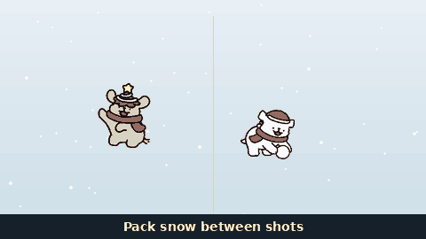

# Maltese Snow War
Open-source fan tribute based on epic flash game “SnowCraft":  a browser-based snowball fight game: three Maltese vs golden retrievers. Hold a dog to move, release to throw, pack snow between shots. Two hits bury; ellipse forts block shots.

**Play Now:** [maltese-snowwar.grok.me](https://maltese-snowwar.grok.me/)

> Unofficial fan tribute (二次創作) to Nicholson NY’s **SnowCraft** (1998). This repo’s dogs are original Christmas chibi pups (小白 / 小金毛). Not affiliated with the original authors.

<p align="center">
  
</p>


## How it plays

| Hold / dodge | Throw |
|:---:|:---:|
|  |  |
| **Pack snow** | **Brawl** |
|  |  |
| **Big snowball** | **Victory** |
|  |  |

- **Hold** a dog to move and dodge; **release** to throw (auto-aims the nearest foe)
- Pack snow between shots — you cannot fire while packing
- Two hits bury a dog; forts eat snowballs that pass through them
- **Big snowball** can drop mid-fight. Hint: *A big snowball appeared! Grab it!*
  - Collect by walking a dog onto the orb **or tapping it**
  - That **team** gets **3 player throws / 10 s** (2 HP). AI throws stay normal. A second pickup refills
  - Thrown big ball matches the field orb (white snow, gold glowing rim). **0.8×** fly speed; vs AI needs **1.2×** hold for max range
  - Clash: big vs a normal ball shrinks the big one (then HP−1); two bigs shatter
  - PvP: blinking red *Opponent has the big snowball!*

> Cheats (test only)
> - Solo **star mode**: tap the Level HUD 5× — faster pack/charge, more HP
> - Host/solo **instant orb**: double-tap the **X vs Y** score HUD

## Modes

| | |
|---|---|
| **vs AI** | You are the Maltese (right, red hats). Retrievers on the left. Easy stays on their half and only throws forward. Hard can cross midfield, shoot backward, and dodge well |
| **vs Friend** | Same URL on two devices. Host is always Maltese; guest is mirrored and plays Retrievers. Share the 6-letter code or QR |
| **Allies** | Unselected Maltese: Manual / Defend (hold forts, peek-throw) / Attack (press in, shoot around forts, punish after the foe throws) |

Languages: English · 繁中 · 简体 · 日本語 · 한국어 (EN + 繁中 load first; others on select). Mute from the landing globe row or **M**.

Landing boot: spinner + English title assets, then Play vs AI / Friend. Action sprites load **after** the mode is chosen (progress bar) — nothing streams in mid-match.

## Character skins

Two casts:

| Pack | Path | Who uses it |
|---|---|---|
| **Line Puppy** (default on grok.me) | `public/sprites/` | Title dogs, in-game, until you switch |
| **Christmas pups** 小白 / 小金毛 | `public/skins/xmas/sprites/` | Tap the title heads to switch |

Snowballs / forts / impacts stay shared in `public/sprites/fx/` (except `buried-*.png`, which follows the skin).

### In the running game

On the title card, tap the **two round dog heads** (top-right, under mute / language). That toggles Line Puppy ⇄ Christmas. The choice is stored as `localStorage.msw-skin-v2`.

[grok.me](https://maltese-snowwar.grok.me/) always **starts on Line Puppy**.

### Swap or add dogs yourself

PNG, ~128×128, **transparent background**, character facing **left** (the game mirrors). Keep `idle-1.png` as the title portrait.

```
red/     idle throw hurt walk pack wave dance   × 1–4.png   ← right team
green/   idle throw hurt walk pack wave dance   × 1–4.png   ← left team
fx/      buried-red.png  buried-green.png
```

- Replace the default cast in `public/sprites/`
- Or drop a second cast in `public/skins/xmas/sprites/` so the title heads can toggle it

Bump `SKIN_VER` in `src/game/assets.ts` if the browser caches old PNGs.

## Local development

```bash
npm ci
npm run dev          # http://0.0.0.0:8080
npm run typecheck
npm test
npm run build
```

## Network

There is no game-sim server. The **host browser is the authority**; a small signaling helper only lets the two browsers find each other.

Host sim + reliable events (`throw` / `hit` / `over` / `loot` / `got` / `claim`). Unreliable binary pose ~14–20 Hz. Throw delay uses a smoothed RTT clamp. If the guest DataChannel stays down ~3s mid-match, local AI (`src/game/ai.ts`) takes over their team.

Details: [Maltese-Snow-War-Architecture.pdf](public/Maltese-Snow-War-Architecture.pdf)

| Layer | Choice |
|--------|--------|
| UI | TanStack Start + React + Vite |
| Sim | Canvas 2D, fixed timestep (`src/game/sim.ts`) |
| Net | WebRTC P2P listen-server (`VersusLink`) |
| Audio | Web Audio holiday loops (no copyrighted carols) |

## Credits

Open-source fan work. Produced by **Gary.TC**. Gameplay after SnowCraft; fight feel also referenced [snowcraftjs](https://github.com/jeffreywilbur/snowcraftjs) by jeffreywilbur.

_This is my first vibe-coding project — let me know if you have thoughts!_
